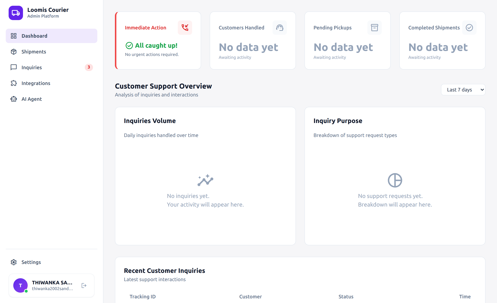
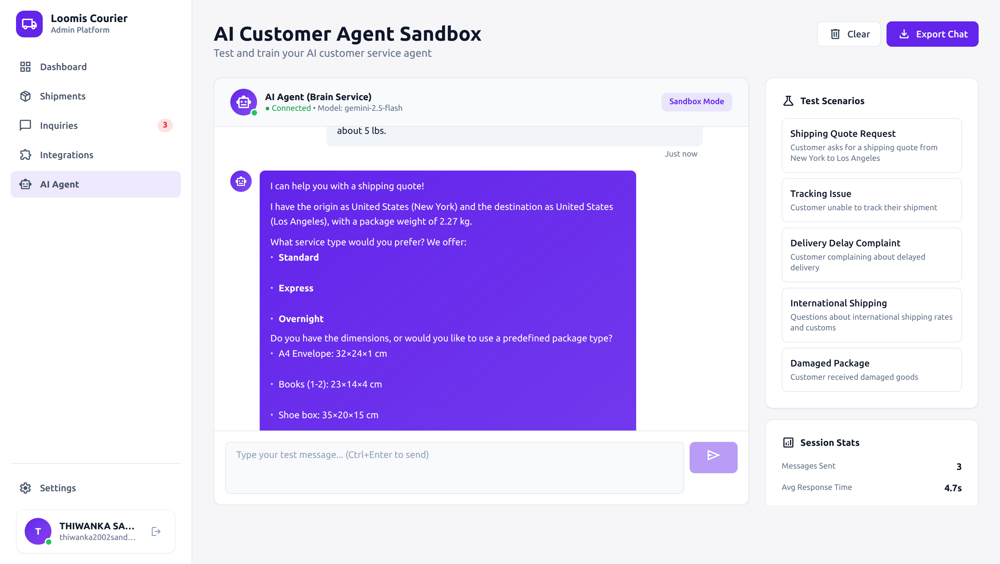
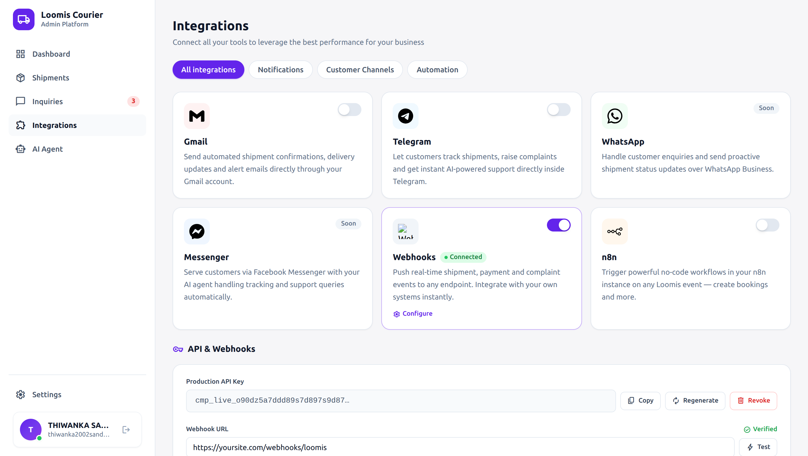

# Loomis SaaS Platform

## Overview
Loomis is a modern SaaS platform designed for courier and logistics businesses. It provides an AI-powered dashboard for managing shipments, rates, customer inquiries, integrations, and business analytics. Loomis leverages advanced AI agents to automate customer support, shipment booking, rate calculation, and system monitoring, streamlining operations for courier companies and their clients.

**Key Value Propositions:**
- **AI Automation:** Specialized agents handle customer inquiries, complaints, shipment tracking, rate calculation, and payments.
- **Unified Dashboard:** Real-time management of shipments, rates, and customer interactions.
- **Extensible Integrations:** Connect with external services (e.g., Telegram, webhooks).
- **Scalable Infrastructure:** Microservices architecture with robust backend and modern Angular frontend.
- **Customizable:** Multi-tenant support, flexible rate and settings management.

---

## Tech Stack

---

## Architecture

For a detailed system architecture, see [docs/architecture.md](docs/architecture.md).

---

## Screenshots

|  |  |  |
|:---------------------------------------------------------:|:-----------------------------------------------------------------------:|:---------------------------------------------------------------:|
| **Dashboard**                                             | **AI Agent Sandbox**                                                    | **Integrations**                                                |

---

## Key Features & Components

- **AI Agents:** adminAgent, customerAgent, financeAgent, shipmentAgent, supportAgent, trackingAgent (see `brain-service/src/application/agents/`)
- **Core Features:** Dashboard, Shipments, Rates, Inquiries, Integrations, Onboarding, Settings (see `admin-dashboard/src/app/features/`)
- **API:** OpenAPI specs in `brain-service/openapi.yaml` and `admin-dashboard/openapi.yaml`
- **Microservices:** Node.js AI service, .NET Core API, MongoDB (see `docker-compose.yml`)

---

## Getting Started

1. **Clone the repository**
2. **Install dependencies** for each service (see respective `package.json` or `.csproj` files)
3. **Run Docker Compose** for infrastructure
4. **Start frontend and backend services**
5. **Access the dashboard** at the configured URL

---

## License

[MIT](LICENSE)

---

*For more details, see the documentation in the `docs/` folder.*
