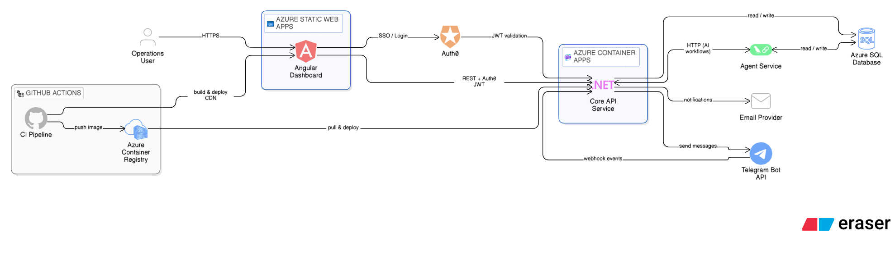
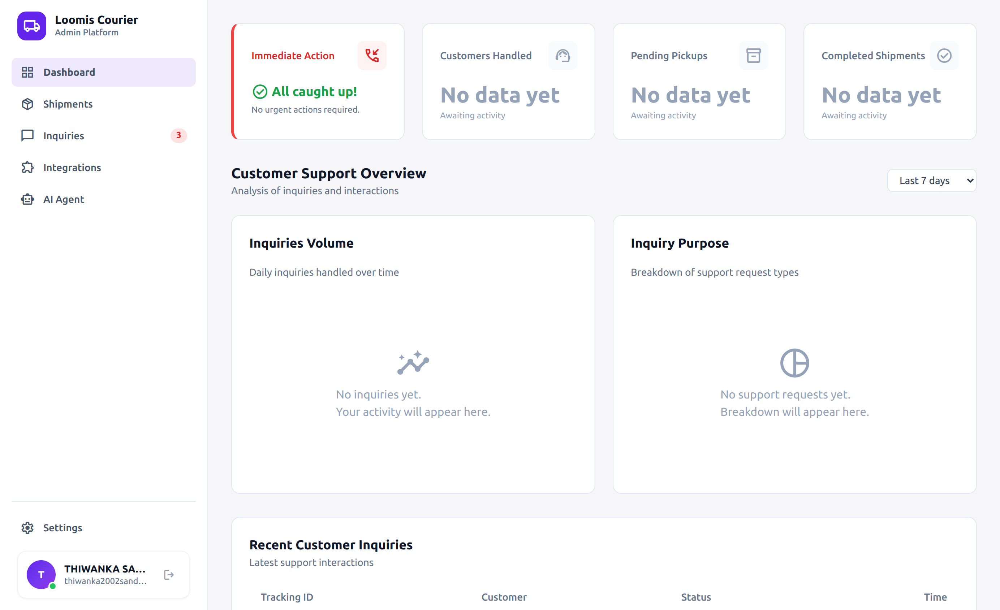
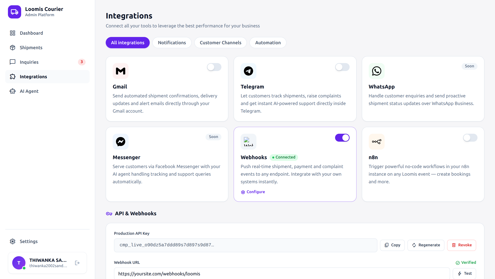
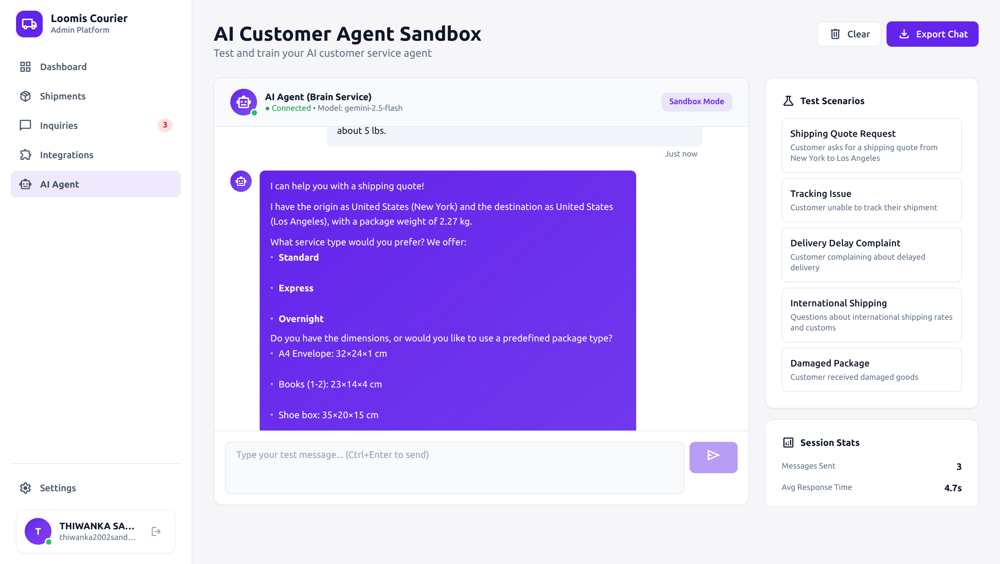

# Loomis SaaS - Multi-Tenant Logistics Operations Platform

Production-grade microservices platform for courier operations, with an Angular admin frontend, .NET backend services, and an independently deployed AI service.



Live Demo: Coming soon (screenshots below)

## 1. Problem Statement

Courier teams often operate across disconnected tools for shipment tracking, pricing, support conversations, onboarding, and operational reporting. This creates context switching, slower response times, and weak traceability across the customer lifecycle.

Loomis solves this by unifying operations into a tenant-aware cloud platform with API-first integration and AI-assisted workflows.

## 2. Key Features and Highlights

- Multi-tenant data isolation with tenant context enforcement at middleware and data access layers.
- Domain APIs for shipments, rates, onboarding, inquiries, sessions, and integrations.
- AI capability separated into an independent service repository to keep core transactional APIs stable.
- External integration workflows for Telegram, email, and provider APIs.
- Auth0-based authentication and role-aware authorization.
- Cloud-native deployment on Azure Container Apps and Azure Static Web Apps.
- CI/CD with GitHub Actions for build, test, and deployment automation.
- Reliability guardrails including correlation IDs, structured exception handling, and plan-based rate limiting.

## 3. Tech Stack

- **Backend**: .NET 10, C#, ASP.NET Core Web API
- **Frontend**: Angular 21
- **Data**: Azure SQL Database
- **Auth**: Auth0 (JWT)
- **Cloud**: Azure Container Apps, Azure Container Registry, Azure Static Web Apps
- **CI/CD**: GitHub Actions
- **API Contract**: OpenAPI
- **Testing**: xUnit, Moq, FluentAssertions, integration testing with Microsoft.AspNetCore.Mvc.Testing

## 4. Product Screenshots

### Dashboard Overview



### Integrations Center



### AI Customer Agent Sandbox



## 5. Getting Started

Prerequisites:
- .NET SDK 10
- Access to required environment variables

Run locally:

```bash
git clone https://github.com/Thiwanka-Sandakalum/loomis-saas.git
cd loomis-saas
cp .env.example .env

# Backend
cd core-service
dotnet restore
dotnet run --project src/CoreCourierService.Api

# Frontend (new terminal)
cd ../admin-dashboard
npm install
npm run start
```

Endpoints:
- Frontend: http://localhost:4200
- API Swagger: http://localhost:8080/swagger

## 6. Testing

Run backend tests:

```bash
dotnet test core-service/tests/CoreCourierService.Tests --configuration Release
```

Test coverage includes:
- Unit tests for controllers, middleware, and services.
- Integration tests for API behavior.

## 7. Key Learnings

- Service boundaries matter: separating AI from transactional APIs improves release safety.
- Tenant-aware architecture needs enforcement in both middleware and data access.
- Integration-heavy systems require resilient error handling and observability from day one.
