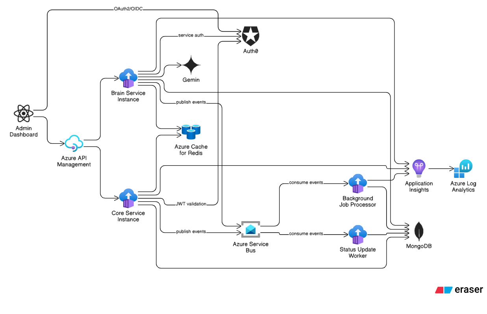
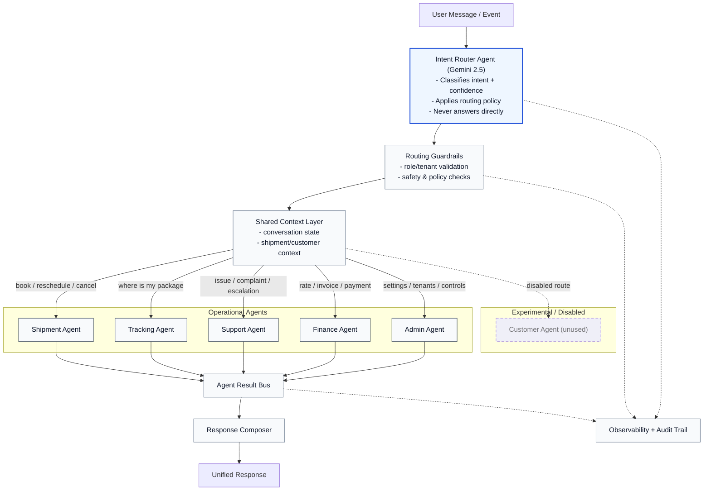

# Loomis SaaS Platform

## Overview
Loomis is a multi-tenant SaaS platform for courier and logistics businesses. It combines a modern operations dashboard with AI-powered agents that automate shipment workflows, tracking, customer support, finance operations, and administrative controls.

Built as a microservices architecture, Loomis includes:
- Angular frontend for operations teams
- .NET backend for core domain and APIs
- TypeScript AI orchestration service for routing and automation
- MongoDB (and optional Redis) for data and caching

**Key Value Propositions:**
- **AI Automation:** Specialized agents handle inquiries, complaints, tracking, rates, and payments.
- **Unified Operations:** One dashboard for shipments, rates, integrations, and settings.
- **API-First Integration:** OpenAPI-driven contracts for internal and external systems.
- **Scalable Platform:** Containerized services, Kubernetes-ready deployment assets.
- **Tenant-Aware Workflows:** Flexible settings and controls for B2B SaaS environments.

## Table of Contents
- [Tech Stack](#tech-stack)
- [Architecture](#architecture)
- [Agent Design](#agent-design)
- [Screenshots](#screenshots)
- [Key Features & Components](#key-features--components)
- [Repository Structure](#repository-structure)
- [Getting Started](#getting-started)
- [Deployment & Infrastructure](#deployment--infrastructure)
- [Documentation](#documentation)
- [License](#license)

## Tech Stack

<p align="center">


</p>

## Architecture


For detailed architecture documentation, see [docs/architecture.md](docs/architecture.md).

## Agent Design


```mermaid
flowchart TB
	User["User Message / Event"] --> Router

	Router["Intent Router Agent (Gemini 2.5)<br/>- Classifies intent + confidence<br/>- Applies routing policy<br/>- Never answers directly"]
	Policy["Routing Guardrails<br/>- role/tenant validation<br/>- safety & policy checks"]
	Context["Shared Context Layer<br/>- conversation state<br/>- shipment/customer context"]
	Router --> Policy
	Policy --> Context

	subgraph OPS["Operational Agents"]
		direction LR
		Shipment["Shipment Agent"]
		Tracking["Tracking Agent"]
		Support["Support Agent"]
		Finance["Finance Agent"]
		Admin["Admin Agent"]
	end

	subgraph EXP["Experimental / Disabled"]
		direction LR
		Customer["Customer Agent (unused)"]
	end

	Context -->|"book / reschedule / cancel"| Shipment
	Context -->|"where is my package"| Tracking
	Context -->|"issue / complaint / escalation"| Support
	Context -->|"rate / invoice / payment"| Finance
	Context -->|"settings / tenants / controls"| Admin
	Context -.->|"disabled route"| Customer

	Shipment --> ResultBus["Agent Result Bus"]
	Tracking --> ResultBus
	Support --> ResultBus
	Finance --> ResultBus
	Admin --> ResultBus

	ResultBus --> Composer["Response Composer"]
	Composer --> UserResponse["Unified Response"]

	Audit["Observability + Audit Trail"]
	Router -.-> Audit
	Policy -.-> Audit
	ResultBus -.-> Audit

	classDef router fill:#eef6ff,stroke:#1d4ed8,color:#0f172a,stroke-width:2px;
	classDef agent fill:#f8fafc,stroke:#334155,color:#0f172a;
	classDef unused stroke-dasharray: 6 4,opacity:0.8;
	classDef infra fill:#f8fafc,stroke:#64748b,color:#0f172a;

	class Router router;
	class Shipment,Tracking,Support,Finance,Admin agent;
	class Customer unused;
	class Policy,Context,ResultBus,Composer,Audit infra;
```

Core orchestration principle: the router delegates, domain agents execute, and response composition stays centralized for consistency and auditability.

---

## Screenshots

|  |  |  |
|:---------------------------------------------------------:|:-----------------------------------------------------------------------:|:---------------------------------------------------------------:|
| **Dashboard**                                             | **AI Agent Sandbox**                                                    | **Integrations**                                                |

---

## Key Features & Components

- **AI Agents:** `adminAgent`, `customerAgent`, `financeAgent`, `shipmentAgent`, `supportAgent`, `trackingAgent` in `brain-service/src/application/agents/`
- **Frontend Domains:** Dashboard, Shipments, Rates, Inquiries, Integrations, Onboarding, Settings in `admin-dashboard/src/app/features/`
- **API Contracts:** OpenAPI specs in `brain-service/openapi.yaml` and `admin-dashboard/openapi.yaml`
- **Runtime Services:** Node.js AI service, .NET API, MongoDB, optional Redis
- **Ops Assets:** Docker Compose, Kubernetes manifests, Terraform modules

---

## Repository Structure

```text
loomis/
├── admin-dashboard/   # Angular frontend
├── brain-service/     # TypeScript AI orchestration and tools
├── core-service/      # .NET API and domain services
├── docs/              # Product and architecture documentation
├── infrastructure/    # Docker, Kubernetes, Terraform, operations docs
├── docker-compose.yml # Local full-stack runtime
└── Makefile           # Local + DevOps command shortcuts
```

---
## Documentation

- System architecture: [docs/architecture.md](docs/architecture.md)
- General docs: `docs/`
- Infrastructure docs: `infrastructure/docs/`

---

---

<p align="center">
	
	
	
	
	
	
	
</p>

<p align="center">
	
	
	
	
	
	
	
</p>

---

*For more details, explore `docs/` and `infrastructure/docs/`.*
